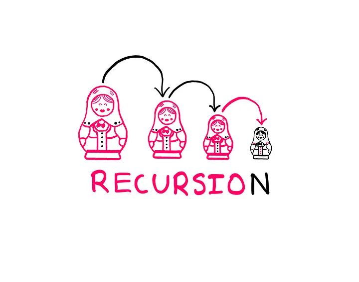

# Introducción a Python

## Semana 14
<!-- .element style="text-align:center" -->

 <!-- .element style="margin-left: auto; margin-right: auto; display: block" -->

---

# Llamadas entre funciones

- Las funciones pueden llamar a otras funciones
- ¿Qué pasa si una función se llama a si misma?

```python
def yo_misma():
    print("Yo misma")
    yo_misma()
```

---

# Recursividad

- Podemos usar las llamadas de una función a sí misma para resolver problemas
- Es una forma de pensar:
  - Si ya tengo la solución de un problema más pequeño, ¿cómo lo resuelvo?
  - Saber resolver un problema pequeño

 <!-- .element style="margin-left: auto; margin-right: auto; display: block" -->

---

# Cómo pensar con recursividad

Nos basamos en suponer que "mágicamente" el problema está resuelto

Hay un "caso base": el problema sencillo que sabemos resolver

Pensad estos ejemplos:
- Factorial de un número
- Imprimir los números del 1 al n
- Número más alto de una lista

---

# Ejercicios


---
